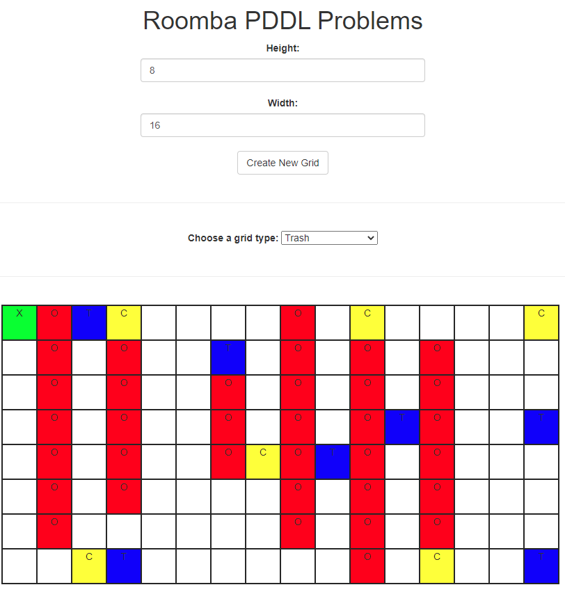
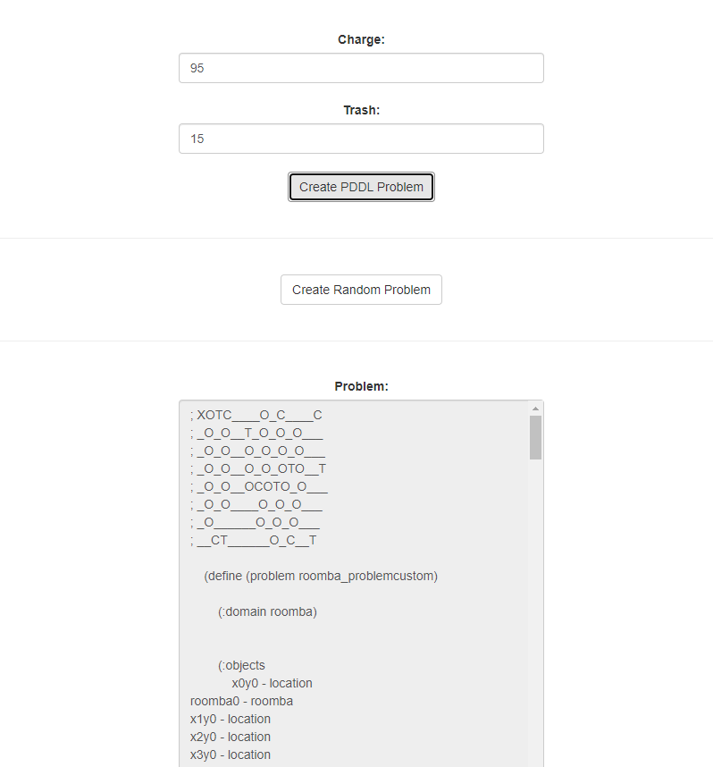

# [roomba_problem_maker](http://zaini.pythonanywhere.com/) 🤖

The Roomba Problem Maker is a short script I've written to make the create of PDDL problem files easier for my INT group project.

You can find more about that project [here.](https://github.com/zaini/INT-Coursework-2021)

# Running

I'm using pywebview for the desktop app GUI. To run that, open the pywebview folder and just run `start.py`

The webapp version is just using flask with a basic API. Instead of writing to files it just displays the problems on the page. You can try a deployed version [here.](http://zaini.pythonanywhere.com/)

# Other

The two version were made using the following languages/frameworks: HTML, JavaScript, CSS, Python, Flask, pywebview

# Screenshots

